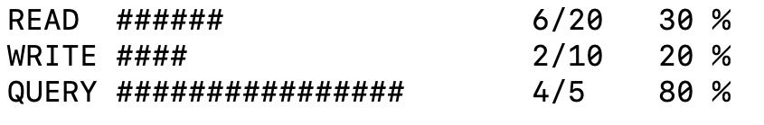

# cloudantmon

`couldantmon` is a simple command line application for checking the usage of your Cloudant service. It shows three moving graphs to indicate your current usage as a proportion of your provisioned throughput capacity for:

- reads
- writes
- queries



The graph lines move every second or so.

## Installation

You need Node.js & npm. Then run:

```
npm install -g cloudantmon
```

## Usage
To run with a Cloudant service using IAM authentication set up environment variables containing your Cloudant URL and api key:

```sh
export CLOUDANT_URL="https://my-cloudant-hostname.cloudant.com"
export CLOUDANT_APIKEY="my-cloudant-api-key"
cloudantmon
```

If you wish to run with HTTP Basic authentication, there are other variables required:

```sh
CLOUDANT_AUTH_TYPE=BASIC
CLOUDANT_URL="https://my-cloudant-hostname.cloudant.com"
CLOUDANT_USERNAME="myusername"
CLOUDANT_PASSWORD="mypassword"
cloudantmon
```

